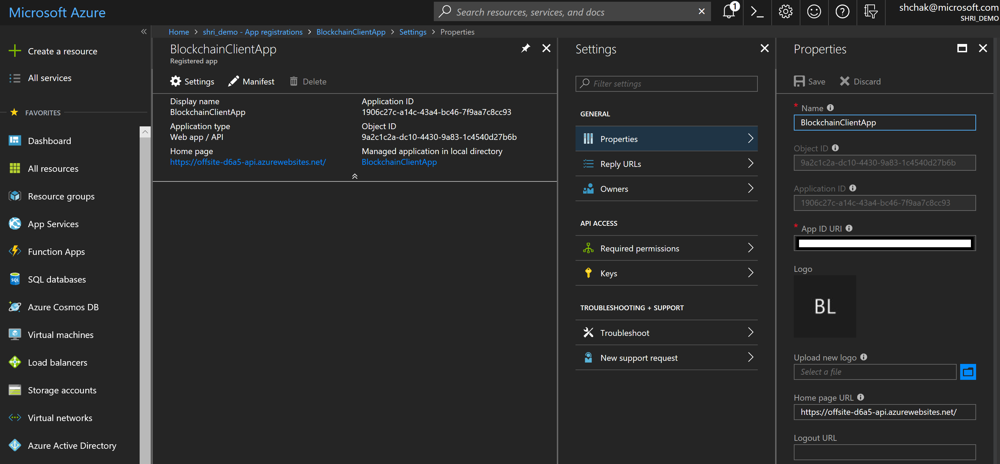
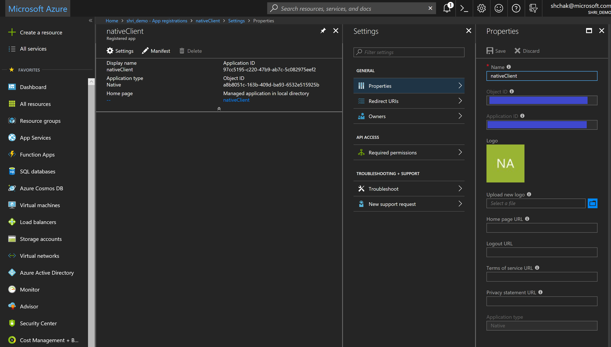
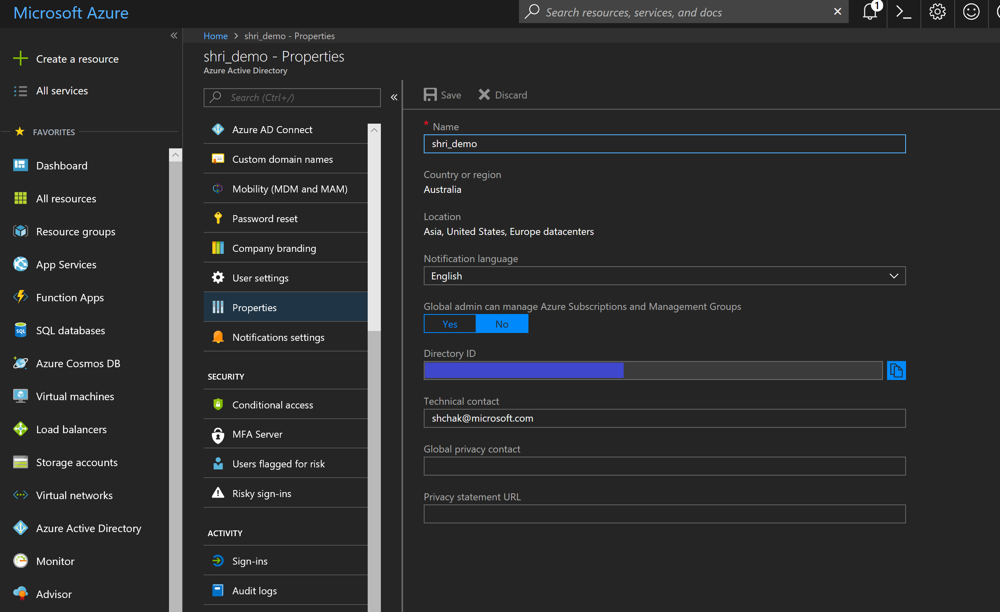

# Introduction 
This is a sample azure funtion to authenticate to another Azure AD protected api   

# Getting Started
TODO: Do to azure AD tenant
1.	Get **tenantId** from the Azure AD tenant -> properties (as shown in the image below)
	**tenant** this is the tenant name of your Azure AD - this should look like example.onmicrosoft.com. 

2.      In App Registration -> create a new native client
Get ApplicationId of the native app for **clientId** and **clientSecret**

2.	Get the tenantID as shown below

3.	**UPN** - username of the user registered in Azure AD
